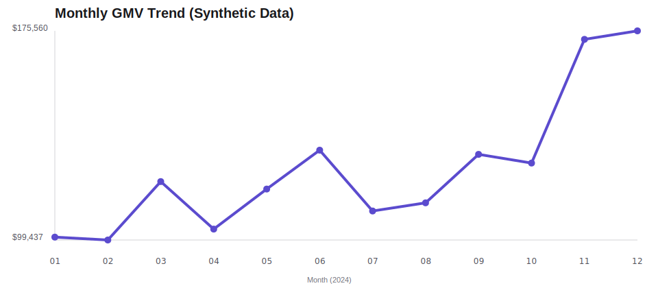

# E-commerce Market Intelligence Dashboard

An end-to-end data analytics portfolio project that converts synthetic e-commerce transactions into market intelligence, campaign evaluation, product monitoring, and practical business recommendations.

> **Data disclaimer:** Every record is generated mock data. No real company, customer, or platform data is used.

## Project Overview

This one-day MVP demonstrates how an analyst can move from raw relational data to decision-ready outputs using Python, Pandas, SQL, CSV, and a BI dashboard specification. The project emphasizes transparent metric definitions and recommendations that business stakeholders can act on.

## Business Problem

An e-commerce team needs a repeatable view of:

- whether GMV and order volume are growing;
- which products and categories drive performance;
- whether campaigns create meaningful incremental value;
- where unusual product sales require investigation;
- which actions should be prioritized by growth, category, and marketing teams.

## Dataset

Six synthetic relational tables are generated with a fixed random seed:

| Table | Grain | Example fields |
|---|---|---|
| `orders` | One row per order | date, customer, status, campaign |
| `order_items` | One row per product in an order | quantity, unit price, discount |
| `products` | One row per product | category, list price, cost |
| `categories` | One row per category | category name |
| `campaigns` | One row per campaign | period, channel, budget, discount |
| `customers` | One row per customer | region, signup date, acquisition channel |

## Analysis Questions

1. How do monthly GMV, completed orders, and AOV change over time?
2. Which 10 products contribute the most GMV?
3. Which categories grew fastest in H2 versus H1?
4. How did daily GMV change before and during each campaign?
5. Which product-day observations are statistically unusual?
6. What inventory, campaign, and monitoring actions follow from the evidence?

## Methodology

1. Generate reproducible synthetic transactions and dimensions.
2. Validate schemas, dates, duplicates, quantities, and prices.
3. Restrict commercial KPIs to completed orders.
4. Build monthly, product, category, and campaign datasets.
5. Flag product-day GMV anomalies using an absolute z-score threshold of 3.
6. Translate results into observation → possible cause → recommended action.

Campaign lift uses an equal-length pre-period comparison. It is useful for triage but does not prove causality; a production study should add holdouts or a causal design.

## Key Findings

Running the pipeline generates current figures in:

- [`outputs/summary_report.md`](outputs/summary_report.md)
- [`outputs/kpi_summary.csv`](outputs/kpi_summary.csv)
- [`outputs/monthly_performance.csv`](outputs/monthly_performance.csv)
- [`outputs/campaign_effectiveness.csv`](outputs/campaign_effectiveness.csv)

The generated scenario typically shows a strong holiday-season peak, product revenue concentration, uneven campaign efficiency, and a manageable product anomaly watchlist.

## Business Recommendations

- Protect inventory availability for high-GMV products before seasonal peaks.
- Allocate campaign budget using incremental value and margin—not gross ROAS alone.
- Test growth investment in fast-growing categories while monitoring stock turnover.
- Route anomaly flags to analysts for campaign, pricing, stock, and data-quality checks.
- Add traffic, conversion, inventory, and contribution-margin data before production use.

## Tech Stack

- Python
- Pandas and NumPy
- SQL
- CSV
- Dependency-free SVG chart output
- BI dashboard specification

## How to Run

```bash
python -m venv .venv
```

Windows:

```powershell
.\.venv\Scripts\Activate.ps1
pip install -r requirements.txt
python src/generate_mock_data.py
python src/clean_data.py
python src/analyze_data.py
```

macOS/Linux:

```bash
source .venv/bin/activate
pip install -r requirements.txt
python src/generate_mock_data.py
python src/clean_data.py
python src/analyze_data.py
```

## Dashboard Preview



Open [`dashboard/index.html`](dashboard/index.html) for the interactive,
dependency-free portfolio dashboard. It supports GMV, order, and AOV trend
switching and includes category, product, campaign, and anomaly views.

The proposed BI layout, definitions, and interactions are documented in:

- [`dashboard/dashboard_spec.md`](dashboard/dashboard_spec.md)
- [`dashboard/dashboard_mockup.md`](dashboard/dashboard_mockup.md)

## Repository Structure

```text
data/raw/          generated source tables
data/processed/    validated analysis-ready tables
sql/               reusable KPI queries
src/               data generation, cleaning, and analysis
outputs/           reports, KPI tables, and chart
dashboard/         dashboard specification and mockup
```

## Resume Highlight

> Built an end-to-end e-commerce market intelligence project using Python, Pandas, and SQL; generated and cleaned six relational mock datasets, analyzed GMV/AOV/product/category/campaign performance, designed anomaly monitoring, and translated findings into a stakeholder-ready dashboard and commercial recommendations.

## Notes for Reviewers

This repository is intentionally scoped as a readable one-day MVP. It favors reproducibility, business interpretation, and clear analytical limitations over unnecessary infrastructure.
